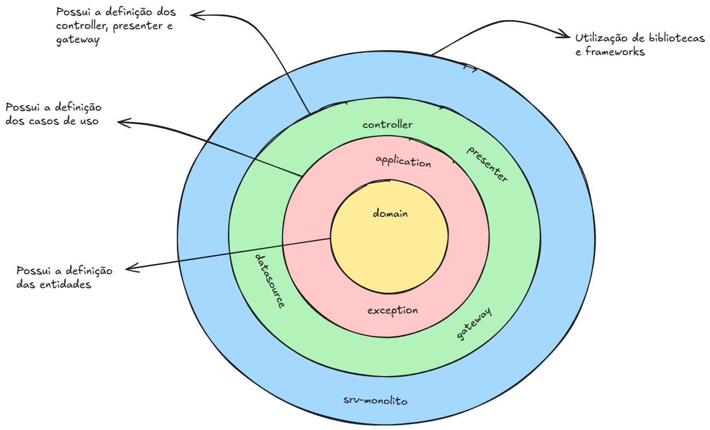

# Tech Challenge 01

## Visão Geral

Este projeto é uma aplicação Java utilizando Maven para gerenciamento de dependências. A aplicação segue os princípios da arquitetura
limpa e é estruturada de forma modular, com múltiplos serviços para gerenciar funcionalidades distintas. A aplicação
está organizada de forma monolítica, com todos os serviços interligados em um único projeto, mas ainda assim respeitando
a modularidade interna para facilitar a evolução e escalabilidade.


## Estrutura do Projeto

| Módulo         | Descrição                                                                          |
|----------------|------------------------------------------------------------------------------------|
| `core`         | Contém a lógica de negócio e interfaces, seguindo os princípios arquitetura limpa. |
| `srv-monolito` | Módulo monolítico que possui as dependências com as bibliotecas e frameworks.      |

## Arquitetura

A aplicação segue a arquitetura limpa, respeitando as quatro camadas proposta pelo Robert Cecil Martin. 
O projeto java está separado em dois módulos, um chamado core que contém as 3 camadas mais internas da arquitetura limpa (entity, use cases e interface adapters). 
O outro módulo chamado de srv-monolito representa a camada mais externa da arquitetura limpa (frameworks and drivers). Abaixo imagem representando como o projeto foi estruturado para respeitar as 4 camadas..



## Pré-requisitos

- Java 21
- Maven 3.9.9
- Docker

## Documentação da API


A documentação da API pode ser acessada através do Swagger em `http://localhost:8080/documentacao.html`.

## Formatação de Código

Este projeto utiliza o Spotless Maven Plugin para garantir que o código esteja formatado de acordo com as convenções
definidas. O plugin pode ser configurado para garantir que o código tenha uma formatação consistente.

- Para verificar se o código segue as convenções de formatação, basta rodar o seguinte comando Maven:

```shell
mvn spotless:check
```

- Formatar o código de acordo com as convenções

```shell
mvn spotless:apply
```

## Relatório de Cobertura de Testes com Jacoco

Este projeto utiliza o Jacoco Maven Plugin para gerar relatórios de cobertura de testes. O Jacoco é uma ferramenta de
análise de cobertura de código, que gera um relatório detalhado mostrando quais partes do código foram testadas.

- Para gerar o relatório de cobertura de testes com Jacoco, basta rodar o seguinte comando Maven:

```shell
mvn clean test
```

O relatório gerado estará localizado na pasta `target/site/jacoco/index.html` Para visualizar o relatório, basta abrir
esse arquivo em um navegador:

___

## 🚀 Como subir a infraestrutura no Kubernetes
Para execução do fluxo completo no kubernetes, é necessário subir a infraestrutura de banco de dados e os dois serviços srv-monolito e mercadopagofake, 
sendo o srv-monolito o serviço criado para desenvolver o desafio do tech-challenge e o mercadopagofake um serviço mock para simular o pagamento com o mercado pago.
Para facilitar o provisionamento da infraestrutura, os arquivos YAML estão disponíveis na pasta k8s de cada recurso.

### 1️⃣ - Crie um namespace (opcional):
```sh
export NAMESPACE=tech-challenge

kubectl create namespace $NAMESPACE
```

### 2️⃣ Executar o script para criação das secrets:
```sh
kubectl apply -f tech-challenge/srv-monolito/k8s/secrets -n $NAMESPACE
```

### 3️⃣ Executar os script para habilitar as métricas do cluster kubernetes:
```sh
kubectl apply -f tech-challenge/srv-monolito/k8s/metricas -n $NAMESPACE
```

### 4️⃣ Executar os script para provisionar o banco de dados:
```sh
kubectl apply -f tech-challenge/srv-monolito/k8s/postgres -n $NAMESPACE
```

### 5️⃣ Executar os script para provisionar o serviço merdacopagofake:
```sh
kubectl apply -f tech-challenge/srv-monolito/k8s/mercadopagofake -n $NAMESPACE
```

### 6️⃣ Executar os script para provisionar o serviço srv-monolito:
```sh
kubectl apply -f tech-challenge/srv-monolito/k8s/srv-monolito -n $NAMESPACE
```

### 7️⃣ - Verifique os pods e serviços:
```sh
kubectl get all -n $NAMESPACE
```
___

## Criando Dashboard:
O Kubernetes Dashboard é uma UI de propósito geral, baseada na web, para clusters Kubernetes. Ele permite que os usuários gerenciem aplicativos em execução no cluster e solucionem problemas, bem como gerenciem o próprio cluster.
Veja mais em no repositório do [github dashboard](https://github.com/kubernetes/dashboard?tab=readme-ov-file).

### 1️⃣ - Adiciona o repositório kubernetes-dashboard
```sh
helm repo add kubernetes-dashboard https://kubernetes.github.io/dashboard/
```

### 2️⃣ - Deploy do Helm Chart
```sh
helm upgrade --install kubernetes-dashboard kubernetes-dashboard/kubernetes-dashboard --create-namespace --namespace kubernetes-dashboard --version 7.5.0
```

### 3️⃣ - Criação do NAMESPACE kubernetes-dashboard
```sh
kubectl create namespace kubernetes-dashboard
```


### 4️⃣ - Criação da Service Account
```sh
kubectl apply -f tech-challenge/srv-monolito/k8s/dashboard/dashboard-adminuser.yaml
```


### 5️⃣ - Criação da ClusterRoleBinding
```sh
kubectl apply -f tech-challenge/srv-monolito/k8s/dashboard/cluster-role-binding.yaml 
```


### 6️⃣ - Criação de secret para Token definitivo
```sh
kubectl apply -f tech-challenge/srv-monolito/k8s/dashboard/secret.yaml 
```


### 7️⃣ - Criação do Token de autenticação
```sh
kubectl get secret admin-user -n kubernetes-dashboard -o jsonpath={".data.token"} | base64 -d
```


### 8️⃣ - Para acessar o Dashboard
```sh
kubectl port-forward -n kubernetes-dashboard svc/kubernetes-dashboard-kong-proxy 8443:443
```

Agora, é só acessar o dashboard em [http://localhost:8443](http://localhost:8443), inserir o token e pronto!
___

## 📜 Licença

Este projeto está sob a licença MIT.
___
